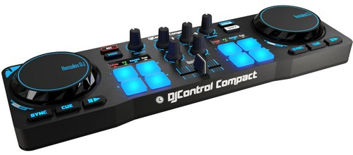

Modification by Philippe F6IFY to use the DJControl Compact midi device

This script is a modification of the original script from the EESDR project
by Matthew McDougal, KA0S

I use Python 3.10, mido doesn't works with python 3.13, I hope it will change in the futur!

See the PDF file for the mapping of the DJControl Compact from Hercules.

[DJControl Compact Mapping PDF](DJControl-sunSDR-v0.1.6.pdf)
