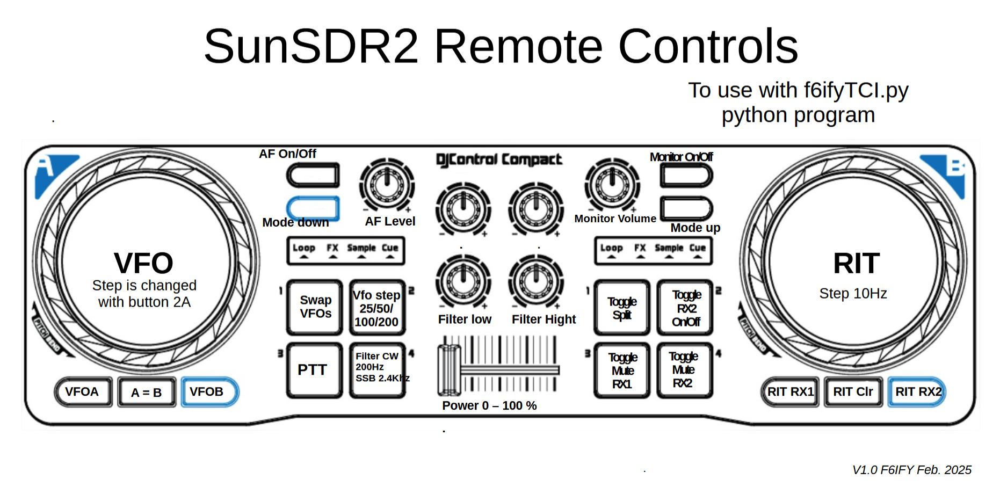

Modification by Philippe F6IFY to use the DJControl Compact midi device

This script is a modification of the original script from 

I use Python 3.10, I don't know exactly why but my script does not work with python 3.13, I hope it will change in the futur!

See the PNG file for the mapping of the DJControl Compact from Hercules.

And the same for the DJControl Starlight...

